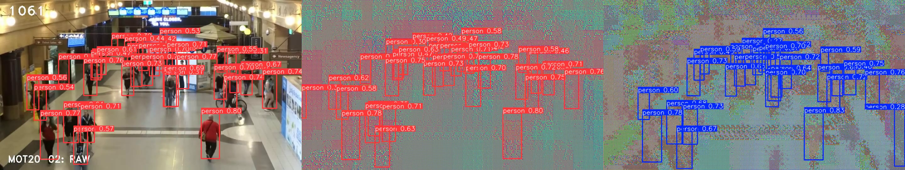

# Privacy-Preserving People Detection in the Wild
Repository for scientific paper "Privacy-Preserving People Detection in the Wild"

# Paper
## Abstract
Detecting people and their attributes in natural conditions is one of the basic tasks of computer
vision systems. Unfortunately, all known algorithms do not provide even the slightest protection
of data privacy. In this paper, we fill this gap by proposing a system for detecting people while
maintaining data privacy thanks to the learnable perceptual encryption of an image immediately after
its acquisition and before detection. A novelty is our proposed version of YOLO detector, equipped
with original input layers that enable effective detection in encrypted images. This is possible thanks
to the use of the Lipschitz cost function and original attention modules. The experimental results using
images from various everyday situations, obtained both in the visible spectrum and in the thermal
band, prove the effectiveness of our method.

## Citation
If you find this code useful for your research, please cite our paper.
```
Paper submitted for peer review
```

# Sample images
Detections on unprocessed images (left), hierarchically scrambled version (middle) and hierarchically scrambled version with additional XORing (right).



# Sample videos
1. https://youtu.be/EGafkZq0obU
2. https://youtu.be/Nrxe4qPaXTc
3. https://youtu.be/q3iSkoLQ4pE
4. https://youtu.be/X6QYLnV7e8Y
5. https://youtu.be/2qaNxsp8smg
